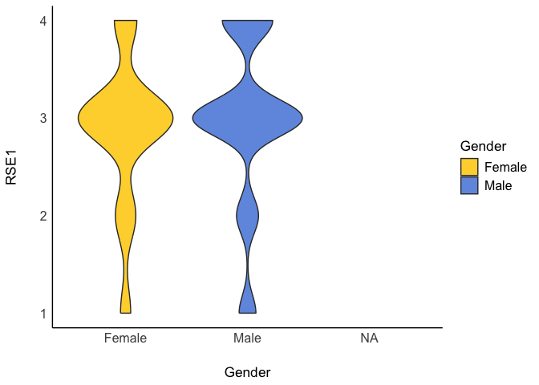
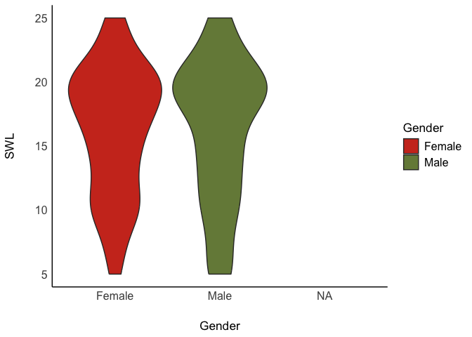

Lab3
================
Your Name
2024-09-19

# Load Packages

``` r
library(haven)
library(dplyr)
```

    ## 
    ## Attaching package: 'dplyr'

    ## The following objects are masked from 'package:stats':
    ## 
    ##     filter, lag

    ## The following objects are masked from 'package:base':
    ## 
    ##     intersect, setdiff, setequal, union

``` r
library(tidyr)
library(ggplot2)
library(psych)
```

    ## 
    ## Attaching package: 'psych'

    ## The following objects are masked from 'package:ggplot2':
    ## 
    ##     %+%, alpha

``` r
library(bruceR)
```

    ## 
    ## bruceR (v2024.6)
    ## Broadly Useful Convenient and Efficient R functions
    ## 
    ## Packages also loaded:
    ## ✔ data.table ✔ emmeans
    ## ✔ dplyr      ✔ lmerTest
    ## ✔ tidyr      ✔ effectsize
    ## ✔ stringr    ✔ performance
    ## ✔ ggplot2    ✔ interactions
    ## 
    ## Main functions of `bruceR`:
    ## cc()             Describe()  TTEST()
    ## add()            Freq()      MANOVA()
    ## .mean()          Corr()      EMMEANS()
    ## set.wd()         Alpha()     PROCESS()
    ## import()         EFA()       model_summary()
    ## print_table()    CFA()       lavaan_summary()
    ## 
    ## For full functionality, please install all dependencies:
    ## install.packages("bruceR", dep=TRUE)
    ## 
    ## Online documentation:
    ## https://psychbruce.github.io/bruceR
    ## 
    ## To use this package in publications, please cite:
    ## Bao, H.-W.-S. (2024). bruceR: Broadly useful convenient and efficient R functions (Version 2024.6) [Computer software]. https://CRAN.R-project.org/package=bruceR

    ## 
    ## These packages are dependencies of `bruceR` but not installed:
    ## - pacman, openxlsx, ggtext, lmtest, vars, phia, MuMIn, GGally
    ## 
    ## ***** Install all dependencies *****
    ## install.packages("bruceR", dep=TRUE)

``` r
library(ggsci)
library(see)
```

    ## 
    ## Attaching package: 'see'

    ## The following objects are masked from 'package:ggsci':
    ## 
    ##     scale_color_material, scale_colour_material, scale_fill_material

# Load Datasets

``` r
lab3data <- read.csv("/Users/leolu/Documents/GitHub/Lab3/lab3data.csv")
```

# Missing Data

``` r
#Listwise deletion
list_lab3data<- drop_na(lab3data)

#pair wise deletion will only be used when you run the actual analysis using "na.rm = TRUE"
```

# Recode Variables: Changing Numeric Values to Characters

``` r
lab3data %>% count(Gender)
```

    ##   Gender   n
    ## 1      1 154
    ## 2      2 145
    ## 3     NA   1

``` r
#Solution 1
lab3data<- lab3data%>%
  mutate_at(c('Gender'),funs(str_replace(., "1", "Male")))
```

    ## Warning: `funs()` was deprecated in dplyr 0.8.0.
    ## ℹ Please use a list of either functions or lambdas:
    ## 
    ## # Simple named list: list(mean = mean, median = median)
    ## 
    ## # Auto named with `tibble::lst()`: tibble::lst(mean, median)
    ## 
    ## # Using lambdas list(~ mean(., trim = .2), ~ median(., na.rm = TRUE))
    ## Call `lifecycle::last_lifecycle_warnings()` to see where this warning was
    ## generated.

``` r
#Solution 2

#lab3data$Gender<-recode(lab3data$Gender, '1' = 'X', '2' = 'Y')


#Now recode 2 into Female

lab3data<- lab3data%>%
  mutate_at(c('Gender'),funs(str_replace(., "2", "Female")))
```

    ## Warning: `funs()` was deprecated in dplyr 0.8.0.
    ## ℹ Please use a list of either functions or lambdas:
    ## 
    ## # Simple named list: list(mean = mean, median = median)
    ## 
    ## # Auto named with `tibble::lst()`: tibble::lst(mean, median)
    ## 
    ## # Using lambdas list(~ mean(., trim = .2), ~ median(., na.rm = TRUE))
    ## Call `lifecycle::last_lifecycle_warnings()` to see where this warning was
    ## generated.

# Recode Variables: Changing Numeric Values to Different Numeric Values

``` r
lab3data %>% count(RSE2)
```

    ##   RSE2   n
    ## 1    1 124
    ## 2    2  86
    ## 3    3  53
    ## 4    4  37

``` r
lab3data$RSE2_R <- 5 - lab3data$RSE2

#check to see if the recoding was successful
lab3data %>% count(RSE2_R)
```

    ##   RSE2_R   n
    ## 1      1  37
    ## 2      2  53
    ## 3      3  86
    ## 4      4 124

``` r
#Now do the same for the other items (5,6,8,9)
lab3data %>% count(RSE5)
```

    ##   RSE5   n
    ## 1    1 117
    ## 2    2 108
    ## 3    3  49
    ## 4    4  26

``` r
lab3data$RSE5_R <- 5 - lab3data$RSE5

lab3data %>% count(RSE5_R)
```

    ##   RSE5_R   n
    ## 1      1  26
    ## 2      2  49
    ## 3      3 108
    ## 4      4 117

``` r
lab3data %>% count(RSE6)
```

    ##   RSE6   n
    ## 1    1 112
    ## 2    2  86
    ## 3    3  66
    ## 4    4  36

``` r
lab3data$RSE6_R <- 5 - lab3data$RSE6

lab3data %>% count(RSE6_R)
```

    ##   RSE6_R   n
    ## 1      1  36
    ## 2      2  66
    ## 3      3  86
    ## 4      4 112

``` r
lab3data %>% count(RSE8)
```

    ##   RSE8  n
    ## 1    1 76
    ## 2    2 94
    ## 3    3 82
    ## 4    4 48

``` r
lab3data$RSE8_R <- 5 - lab3data$RSE8

lab3data %>% count(RSE8_R)
```

    ##   RSE8_R  n
    ## 1      1 48
    ## 2      2 82
    ## 3      3 94
    ## 4      4 76

``` r
lab3data %>% count(RSE9)
```

    ##   RSE9   n
    ## 1    1 143
    ## 2    2  90
    ## 3    3  38
    ## 4    4  29

``` r
lab3data$RSE9_R <- 5 - lab3data$RSE9

lab3data %>% count(RSE9_R)
```

    ##   RSE9_R   n
    ## 1      1  29
    ## 2      2  38
    ## 3      3  90
    ## 4      4 143

# Create Composites

``` r
#Depending on the scale, sometimes you need to average across the items, other times you might need to sum 


#Fill in the items
lab3data <- lab3data %>%
  mutate(RSE = rowMeans(cbind(RSE1, RSE2_R, RSE3, RSE4, RSE5_R, RSE6_R, RSE7, RSE8_R, RSE9_R, RSE10)))

#Create another composite for SWL, but this time use rowSums

lab3data <- lab3data %>%
  mutate(SWL = rowSums(cbind(SWL1, SWL2, SWL3, SWL4, SWL5)))
```

# Get Summary Descriptive Statistics

``` r
lab3data %>%
  group_by(Gender) %>%
  dplyr::summarize(mean_RSE    = mean(RSE),
      mean_SWL    = mean(SWL),
      std_dev_RSE = sd(RSE),
      std_dev_SWL = sd(SWL),
      corr_RSE_SWL  = cor(RSE, SWL)
    )
```

    ## # A tibble: 3 × 6
    ##   Gender mean_RSE mean_SWL std_dev_RSE std_dev_SWL corr_RSE_SWL
    ##   <chr>     <dbl>    <dbl>       <dbl>       <dbl>        <dbl>
    ## 1 Female     2.98     16.3       0.641        4.97        0.356
    ## 2 Male       3.12     16.2       0.683        5.48        0.496
    ## 3 <NA>       2.6      16        NA           NA          NA

# Q1: Descrptively, which group has a higher self-esteem? What about life satisfaction? Is the relationship between self-esteem and life satisfaction stronger for males or for females?

Descriptively, males have higher self esteem while females have higher
life satisfaction. Males have higher correlation between self-esteem and
life satisfaction. The relationship between self-esteem and life
satisfaction is stronger for males.

# Visualization of Data Distribution

``` r
lab3data %>%
  drop_na(Gender)
```

    ##     RSE1 RSE2 RSE3 RSE4 RSE5 RSE6 RSE7 RSE8 RSE9 RSE10 SWL1 SWL2 SWL3 SWL4 SWL5
    ## 1      1    4    1    1    4    4    1    4    4     1    1    1    1    1    1
    ## 2      1    3    3    3    4    4    3    4    3     1    4    4    4    4    2
    ## 3      3    2    3    3    2    2    3    2    2     3    4    4    4    4    4
    ## 4      3    2    3    3    2    2    3    3    2     3    4    4    4    4    4
    ## 5      3    1    3    4    1    1    4    1    1     4    4    4    4    4    2
    ## 6      2    3    3    3    3    3    3    2    3     2    2    2    2    2    2
    ## 7      3    1    4    4    1    2    4    2    1     3    4    5    5    5    2
    ## 8      3    1    4    3    1    2    3    2    1     4    5    5    5    4    4
    ## 9      3    1    3    3    1    3    3    3    1     3    4    3    4    4    4
    ## 10     3    4    3    4    3    2    4    3    4     3    4    5    4    5    4
    ## 11     4    1    4    4    1    1    4    2    1     4    4    4    4    4    3
    ## 12     1    4    3    3    3    4    4    1    4     1    1    1    2    1    1
    ## 13     4    2    3    3    2    1    3    2    1     4    4    4    4    4    5
    ## 14     2    2    4    4    2    3    4    2    2     1    1    1    2    4    4
    ## 15     3    2    4    4    1    2    4    3    1     4    4    2    4    4    2
    ## 16     3    4    4    4    2    4    4    4    1     3    4    4    4    5    2
    ## 17     3    1    3    3    2    3    3    3    2     2    4    4    2    2    2
    ## 18     3    2    3    3    2    2    3    2    2     3    2    2    4    2    2
    ## 19     3    1    4    4    2    2    4    2    1     4    2    2    2    4    1
    ## 20     4    1    4    4    1    1    4    1    1     4    4    4    5    4    2
    ## 21     2    4    4    4    4    4    1    4    4     1    1    1    1    3    3
    ## 22     1    4    2    2    1    4    2    4    4     1    5    5    5    5    4
    ## 23     1    3    3    3    3    3    3    3    3     2    1    1    1    1    1
    ## 24     3    1    3    4    1    2    4    2    1     3    4    4    4    4    2
    ## 25     3    1    3    4    1    1    4    3    1     3    2    2    3    2    1
    ## 26     3    2    4    3    1    3    3    1    1     3    4    5    2    2    1
    ## 27     2    2    3    3    2    2    3    4    2     2    2    4    2    2    1
    ## 28     3    3    2    2    3    3    2    3    3     2    3    3    4    3    4
    ## 29     3    2    3    3    2    2    3    2    2     3    2    4    2    2    2
    ## 30     3    3    3    4    2    3    3    3    3     3    3    3    3    1    1
    ## 31     3    2    3    3    2    2    3    2    2     3    4    4    4    3    4
    ## 32     3    3    3    3    2    3    3    3    2     3    4    4    4    4    4
    ## 33     2    1    3    2    3    3    2    4    2     2    5    5    4    5    5
    ## 34     4    1    4    3    2    1    3    1    1     3    2    3    4    3    2
    ## 35     3    1    3    3    1    1    3    1    1     4    4    4    4    4    1
    ## 36     3    1    4    4    1    1    4    1    1     3    4    4    4    4    1
    ## 37     3    4    3    3    2    4    3    4    1     2    4    4    2    2    1
    ## 38     3    1    4    4    1    1    3    2    1     2    4    4    5    4    2
    ## 39     1    3    2    2    4    3    2    3    4     2    1    1    1    1    1
    ## 40     3    4    3    3    4    4    3    3    3     4    4    5    5    5    5
    ## 41     3    2    4    3    2    2    3    2    2     3    4    4    4    5    2
    ## 42     4    1    4    4    1    1    4    3    1     4    4    5    5    5    2
    ## 43     1    3    3    3    3    3    3    3    3     2    1    1    1    1    1
    ## 44     3    3    3    3    2    3    3    3    1     3    4    4    4    4    4
    ## 45     3    2    3    3    2    1    3    3    2     3    4    4    5    4    4
    ## 46     4    4    4    4    1    1    4    3    1     4    2    5    5    5    2
    ## 47     4    3    4    3    4    3    4    3    4     3    5    4    5    4    5
    ## 48     4    1    4    4    1    1    4    2    1     3    4    4    4    4    2
    ## 49     3    1    4    3    1    2    4    2    1     4    4    4    5    4    4
    ## 50     4    1    4    4    1    1    4    1    1     4    5    5    5    5    4
    ## 51     4    1    4    4    3    1    4    1    2     4    3    3    3    3    3
    ## 52     3    2    3    3    2    2    3    3    2     3    3    3    3    3    1
    ## 53     3    1    3    3    1    3    3    1    1     3    2    2    2    2    1
    ## 54     4    1    4    4    1    1    4    1    1     4    5    4    5    5    5
    ## 55     1    4    3    3    1    3    3    4    3     1    1    3    1    3    1
    ## 56     3    1    4    4    2    1    3    2    2     3    4    4    4    4    3
    ## 57     4    1    4    3    2    1    4    1    1     4    4    3    2    3    2
    ## 58     2    3    4    4    2    3    4    2    2     4    2    4    2    2    1
    ## 59     1    4    1    4    4    4    1    1    4     1    3    3    1    1    1
    ## 60     3    2    3    4    2    2    3    2    2     3    2    2    2    2    1
    ## 61     4    1    4    4    1    1    4    2    1     4    4    5    5    4    1
    ## 62     3    1    4    4    1    1    4    1    1     3    3    3    3    4    2
    ## 63     4    1    4    4    1    1    4    1    1     4    4    5    5    4    4
    ## 64     3    2    3    3    2    2    3    2    2     3    4    4    4    4    4
    ## 65     3    1    3    3    1    1    3    1    1     3    2    2    2    2    2
    ## 66     3    2    3    3    1    2    4    3    2     3    2    4    3    5    5
    ## 67     3    2    3    3    2    2    3    2    2     3    4    4    4    3    3
    ## 68     3    1    4    4    1    1    4    1    1     3    4    4    3    3    2
    ## 69     2    3    3    2    3    3    2    3    3     2    1    1    1    1    1
    ## 70     2    3    2    2    3    4    1    3    4     2    2    2    2    2    2
    ## 71     3    2    3    3    1    2    3    3    2     4    4    4    4    4    2
    ## 72     3    3    3    3    2    3    3    2    2     3    3    3    3    2    2
    ## 73     3    3    4    4    2    3    4    3    2     3    4    4    4    2    1
    ## 74     3    1    4    4    1    1    4    2    1     3    3    3    3    3    2
    ## 75     4    2    3    3    1    1    3    2    1     4    4    5    5    4    3
    ## 76     3    1    4    3    1    1    3    2    1     4    4    3    3    3    2
    ## 77     4    1    4    3    1    1    4    2    2     4    2    2    4    4    2
    ## 78     3    2    4    3    1    1    3    1    1     3    4    4    4    4    3
    ## 79     3    2    3    3    2    2    3    2    2     3    4    4    4    4    4
    ## 80     3    2    3    3    3    3    3    3    2     3    2    2    3    2    2
    ## 81     3    1    4    4    2    1    3    1    1     4    2    2    4    2    1
    ## 82     3    4    3    4    3    4    3    4    3     3    4    3    4    5    4
    ## 83     3    4    3    4    3    4    3    4    3     4    4    5    4    5    5
    ## 84     3    1    3    4    1    1    3    2    1     3    2    3    4    3    2
    ## 85     1    4    2    2    4    4    2    3    4     1    1    2    2    1    1
    ## 86     3    2    3    3    2    2    3    2    2     3    2    3    2    2    2
    ## 87     3    4    3    4    4    3    2    4    3     3    4    3    4    4    5
    ## 88     3    2    3    4    2    2    3    2    1     3    2    4    4    1    1
    ## 89     3    3    3    3    2    3    3    3    1     3    2    2    4    2    1
    ## 90     3    4    3    4    3    4    3    4    3     4    4    3    5    4    5
    ## 91     3    4    4    3    3    4    4    3    3     4    4    5    4    3    4
    ## 92     4    4    3    4    3    4    3    4    3     4    4    5    4    5    4
    ## 93     4    1    4    4    1    1    4    2    1     4    4    4    4    4    1
    ## 94     3    4    3    4    2    3    4    3    4     3    4    5    4    5    4
    ## 95     4    1    4    4    1    1    4    2    1     4    5    5    5    5    5
    ## 96     3    2    3    3    2    2    4    2    1     3    3    4    4    3    3
    ## 97     3    4    3    4    3    4    3    4    3     4    4    5    4    5    4
    ## 98     3    4    3    4    3    4    3    4    3     4    4    5    4    5    4
    ## 99     2    4    3    4    3    4    4    4    4     4    3    5    4    5    4
    ## 100    3    4    3    4    3    4    3    4    3     4    4    5    4    4    5
    ## 101    3    4    3    4    3    4    3    4    3     4    4    5    4    5    4
    ## 102    1    2    3    3    2    3    3    3    2     3    1    2    2    2    1
    ## 103    3    2    3    3    2    2    3    2    2     3    4    4    4    4    4
    ## 104    3    1    3    3    1    2    4    1    1     3    4    4    4    4    4
    ## 105    3    2    3    3    2    2    3    2    2     3    4    4    4    3    4
    ## 106    3    3    3    3    3    3    3    2    2     3    3    3    4    3    2
    ## 107    1    3    1    1    3    3    2    3    4     1    2    1    1    1    1
    ## 108    3    4    3    4    3    3    2    3    2     3    4    3    5    4    4
    ## 109    3    2    3    3    2    2    3    2    1     3    4    4    5    4    2
    ## 110    3    3    3    3    2    3    3    3    2     2    2    2    4    4    3
    ## 111    3    4    3    4    3    4    3    4    3     4    4    5    4    5    4
    ## 112    4    3    3    4    3    3    4    3    3     4    5    4    4    5    4
    ## 113    4    2    4    4    2    2    4    1    1     4    4    4    4    4    1
    ## 114    4    1    4    4    1    1    3    1    1     4    4    4    5    4    2
    ## 115    3    2    3    4    2    2    4    3    2     2    2    2    2    2    2
    ## 116    2    3    2    2    3    3    2    3    3     2    1    2    2    1    1
    ## 117    4    3    4    3    4    3    4    3    4     3    5    4    5    5    5
    ## 118    3    1    4    4    1    1    4    1    1     4    2    3    2    2    3
    ## 119    3    3    3    3    2    4    3    4    2     3    4    4    4    4    1
    ## 120    3    2    3    3    2    2    3    3    2     3    2    2    2    2    2
    ## 121    3    2    3    3    2    1    3    3    2     3    4    4    4    4    4
    ## 122    2    2    3    3    2    2    3    2    2     2    2    2    2    2    1
    ## 123    2    2    2    3    3    3    2    4    4     2    1    1    1    1    1
    ## 124    3    1    4    4    4    1    4    1    1     4    4    3    4    4    4
    ## 125    1    3    3    3    4    3    3    3    4     2    1    2    1    1    2
    ## 126    3    2    3    3    2    1    3    2    1     3    4    4    4    4    4
    ## 127    4    1    4    4    1    1    4    1    1     4    4    4    4    4    4
    ## 128    2    4    2    2    4    4    1    4    4     2    2    4    2    1    2
    ## 129    3    1    4    4    2    1    4    2    1     3    2    3    4    4    2
    ## 130    4    1    4    4    1    1    4    3    1     4    5    5    5    5    5
    ## 131    2    3    3    4    3    3    3    3    3     3    2    2    2    2    1
    ## 132    4    1    4    4    1    1    1    1    1     4    4    3    4    4    1
    ## 133    3    1    4    3    1    1    3    1    1     4    4    5    4    5    2
    ## 134    2    1    3    3    2    1    3    2    1     2    2    2    2    2    3
    ## 135    3    1    4    3    2    1    3    2    1     4    4    5    4    4    3
    ## 136    3    2    3    3    2    2    3    2    2     3    4    4    4    4    3
    ## 137    3    2    4    3    2    2    4    3    2     3    4    4    4    3    2
    ## 138    2    2    3    3    3    2    2    2    2     2    2    2    2    2    2
    ## 139    4    1    4    4    1    1    4    1    1     4    5    5    5    5    4
    ## 140    3    1    3    3    2    1    4    3    1     4    2    2    3    3    1
    ## 141    3    2    3    3    2    2    3    2    2     3    3    3    4    4    2
    ## 142    3    2    3    4    2    2    4    2    2     3    3    4    3    4    3
    ## 143    3    1    3    3    1    2    3    3    1     2    4    4    4    4    4
    ## 144    2    3    2    2    4    4    3    3    4     2    2    2    1    1    1
    ## 145    3    1    3    3    1    1    3    1    1     3    4    4    4    4    4
    ## 146    3    2    3    4    2    2    3    2    2     3    3    3    4    3    1
    ## 147    3    1    3    3    1    1    3    1    1     3    4    4    4    4    4
    ## 148    3    1    4    4    1    1    4    2    1     3    4    3    4    5    4
    ## 149    3    2    4    3    2    2    3    2    2     1    1    1    2    1    1
    ## 150    3    2    3    3    3    2    3    4    2     3    2    2    2    2    1
    ## 151    3    2    3    3    2    2    3    2    2     3    4    4    5    4    4
    ## 152    3    2    3    3    2    2    3    2    2     3    4    4    4    3    1
    ## 153    3    2    3    3    1    3    3    3    1     3    5    5    3    3    1
    ## 154    3    3    4    4    3    3    4    3    4     4    4    3    4    5    4
    ## 155    3    2    3    3    2    3    3    2    1     3    4    4    4    5    4
    ## 156    3    1    3    3    1    1    3    1    1     3    4    4    4    4    4
    ## 157    3    2    4    4    1    2    4    1    1     4    4    4    4    4    2
    ## 158    1    4    1    1    4    4    1    4    4     1    1    1    1    2    1
    ## 159    3    1    3    3    1    1    3    2    1     3    4    4    4    4    4
    ## 160    4    1    4    4    1    1    4    1    1     4    1    4    4    4    1
    ## 161    1    4    1    2    4    4    2    4    4     1    1    1    1    1    1
    ## 162    3    2    3    3    2    2    4    1    1     4    1    1    4    4    1
    ## 163    3    2    3    3    2    2    3    2    2     3    4    4    4    4    3
    ## 164    4    1    4    4    1    1    4    1    1     4    5    5    5    5    4
    ## 165    3    2    3    3    2    2    3    2    2     3    4    3    4    4    2
    ## 166    3    2    3    4    2    2    3    3    2     2    4    2    4    4    2
    ## 167    3    1    3    4    1    1    4    2    1     3    1    1    1    1    1
    ## 168    4    1    4    4    1    1    4    1    1     4    5    5    5    5    5
    ## 169    3    1    4    4    1    1    4    2    1     3    1    3    4    2    1
    ## 170    3    1    3    3    1    1    3    1    1     3    4    4    4    4    4
    ## 171    4    1    4    4    1    1    4    1    1     4    4    4    5    4    1
    ## 172    4    1    3    3    1    1    4    1    1     3    4    4    4    4    4
    ## 173    4    2    3    3    1    2    3    2    1     3    4    4    5    4    4
    ## 174    3    2    3    4    2    2    4    2    2     3    4    3    4    4    3
    ## 175    3    2    3    3    2    2    3    2    2     3    3    3    3    3    2
    ## 176    4    1    4    4    1    1    4    1    1     4    4    4    4    4    1
    ## 177    2    3    3    2    3    4    2    3    3     2    2    2    3    2    1
    ## 178    3    1    3    3    1    2    4    3    1     3    4    4    4    4    2
    ## 179    4    1    4    4    1    1    4    1    1     4    5    5    5    4    4
    ## 180    3    2    4    4    1    1    4    2    1     3    4    4    4    4    2
    ## 181    1    4    3    3    4    4    3    4    4     1    1    1    1    1    1
    ## 182    4    1    4    4    1    1    4    3    1     4    3    2    3    1    1
    ## 183    3    1    3    3    1    1    3    3    3     3    4    4    4    4    2
    ## 184    4    1    3    4    1    1    4    2    1     3    4    4    4    4    4
    ## 185    3    2    3    3    2    2    3    2    1     3    4    4    5    4    2
    ## 186    4    3    4    2    2    1    4    4    4     2    4    1    3    5    2
    ## 187    4    1    4    4    2    2    3    1    1     4    4    5    4    4    4
    ## 188    1    2    4    3    3    1    3    4    1     2    1    3    5    4    5
    ## 189    1    4    1    3    4    4    1    3    4     1    1    1    1    1    1
    ## 190    3    2    1    4    4    3    3    1    2     3    4    3    2    3    4
    ## 191    2    3    3    2    3    3    2    3    3     1    2    2    2    2    2
    ## 192    3    1    3    3    1    1    3    2    2     4    4    4    4    4    1
    ## 193    3    1    4    4    1    1    4    1    1     4    2    3    2    2    3
    ## 194    3    2    3    3    1    2    3    3    1     3    5    5    5    4    2
    ## 195    4    1    4    4    1    1    4    1    1     4    5    5    5    5    5
    ## 196    3    1    3    4    2    2    3    2    1     3    2    2    2    4    1
    ## 197    3    1    4    4    1    3    4    3    1     4    4    4    5    4    2
    ## 198    3    2    3    3    2    2    3    2    2     3    4    4    4    4    3
    ## 199    2    3    3    3    2    3    3    3    2     3    2    2    2    2    2
    ## 200    3    2    3    3    3    2    3    3    2     3    4    4    4    4    4
    ## 201    3    1    4    4    1    1    4    1    1     4    4    5    5    5    2
    ## 202    3    2    3    3    3    2    3    2    2     4    3    3    4    4    3
    ## 203    3    3    3    3    4    3    3    3    4     2    4    4    2    2    2
    ## 204    2    1    3    3    2    2    4    3    2     3    2    1    2    3    2
    ## 205    3    2    3    3    2    2    3    2    2     3    4    4    4    4    4
    ## 206    4    1    4    4    1    1    4    1    1     4    4    5    5    4    5
    ## 207    3    2    3    3    2    2    3    2    2     3    2    2    2    1    1
    ## 208    3    1    3    1    1    1    3    1    1     4    3    4    4    4    4
    ## 209    2    1    3    3    2    1    3    4    1     2    2    2    2    2    4
    ## 210    4    1    4    4    1    1    4    1    1     4    4    4    4    4    4
    ## 211    3    3    3    4    4    3    3    4    3     3    4    4    5    5    4
    ## 212    3    2    3    3    2    2    3    2    2     3    4    4    4    4    4
    ## 213    3    2    3    3    2    2    3    3    2     3    4    4    4    4    2
    ## 214    3    4    3    2    2    3    4    3    2     3    4    5    3    4    4
    ## 215    3    3    4    4    3    3    4    4    3     3    4    3    4    4    4
    ## 216    3    1    3    3    2    2    3    2    2     3    2    2    3    4    2
    ## 217    3    2    3    3    2    2    3    2    2     3    3    3    3    3    3
    ## 218    3    1    3    3    1    1    3    3    1     3    2    3    4    4    1
    ## 219    4    1    4    4    1    1    4    1    1     4    4    4    4    4    2
    ## 220    3    2    3    2    3    3    4    2    2     3    4    4    4    2    1
    ## 221    3    4    3    2    3    4    3    2    3     4    5    4    5    4    3
    ## 222    4    1    4    4    1    2    4    1    1     4    5    5    5    5    5
    ## 223    4    3    4    3    4    4    3    3    4     4    4    5    4    4    5
    ## 224    3    3    3    3    2    3    3    4    2     3    4    4    4    4    2
    ## 225    3    1    3    3    2    2    3    1    1     3    3    2    3    4    2
    ## 226    4    1    4    4    1    1    4    4    1     4    5    5    5    5    5
    ## 227    2    1    3    3    2    1    4    1    1     4    1    4    1    1    1
    ## 228    4    1    4    4    1    1    4    1    1     4    5    5    5    5    5
    ## 229    3    3    4    3    1    3    3    1    1     4    4    4    4    4    4
    ## 230    4    1    4    3    4    1    4    1    1     4    4    5    4    4    1
    ## 231    3    1    4    4    1    1    3    1    1     4    2    2    4    4    2
    ## 232    3    2    2    3    3    3    3    3    2     3    4    4    4    3    2
    ## 233    4    1    4    4    1    1    4    1    1     4    3    2    4    4    4
    ## 234    2    3    3    1    2    2    1    3    3     2    4    2    3    3    2
    ## 235    3    2    3    3    2    2    3    3    2     3    4    4    4    4    4
    ## 236    2    3    4    3    1    2    3    3    2     2    4    4    2    4    2
    ## 237    2    4    3    2    3    4    3    4    2     2    2    2    2    4    1
    ## 238    4    3    4    4    1    3    4    2    1     4    1    5    5    4    1
    ## 239    3    1    4    4    2    1    4    2    1     3    4    4    4    4    5
    ## 240    3    2    3    3    2    2    3    2    2     3    4    4    4    4    4
    ## 241    3    4    3    3    2    4    4    4    2     3    4    3    4    4    3
    ## 242    3    2    4    4    1    2    4    1    1     4    4    4    4    2    2
    ## 243    3    2    4    3    1    3    3    2    2     3    2    2    4    4    2
    ## 244    3    2    3    3    1    2    4    2    1     3    4    4    4    4    2
    ## 245    3    1    4    4    1    1    4    1    1     4    2    2    3    3    2
    ## 246    3    2    3    3    2    3    3    2    2     3    2    2    2    2    2
    ## 247    3    1    4    4    1    1    4    1    1     4    4    4    4    4    5
    ## 248    3    1    3    4    1    1    4    1    1     4    2    4    3    2    2
    ## 249    3    2    3    4    2    2    3    2    2     3    3    3    3    3    2
    ## 250    1    1    4    4    1    1    4    1    1     4    1    1    1    1    1
    ## 251    3    2    3    3    2    3    3    3    3     2    3    3    3    3    3
    ## 252    4    1    4    4    1    1    4    4    1     4    5    5    5    5    5
    ## 253    2    2    3    3    3    2    3    3    3     2    1    2    2    1    1
    ## 254    4    1    4    3    1    1    4    2    1     4    4    4    4    4    2
    ## 255    4    1    4    4    1    1    4    1    1     4    4    4    5    4    3
    ## 256    3    2    3    3    2    2    3    2    1     3    4    4    4    4    2
    ## 257    2    4    3    2    4    3    2    3    2     4    3    4    5    3    4
    ## 258    3    2    3    3    2    2    3    2    2     3    4    4    4    5    4
    ## 259    3    3    3    3    3    2    3    3    1     3    2    3    3    2    2
    ## 260    2    3    2    2    2    3    3    3    3     2    4    3    4    4    2
    ## 261    2    3    2    2    3    3    2    4    3     1    2    2    2    2    1
    ## 262    2    2    3    3    2    2    3    3    2     2    2    2    2    2    2
    ## 263    3    1    4    3    1    1    3    1    1     4    4    5    4    5    2
    ## 264    4    1    3    4    2    1    3    2    1     3    4    5    5    5    4
    ## 265    1    3    3    3    3    3    2    4    3     1    1    2    2    2    1
    ## 266    4    1    4    4    1    1    4    1    1     4    5    5    5    5    5
    ## 267    3    1    3    3    2    1    3    3    2     3    2    2    3    3    1
    ## 268    3    1    3    3    3    1    3    1    1     3    4    3    4    4    4
    ## 269    4    1    4    4    1    1    4    1    1     4    4    4    4    4    4
    ## 270    4    1    3    3    2    1    3    2    1     3    4    4    4    5    4
    ## 271    3    2    3    3    2    3    3    3    2     3    2    2    3    3    2
    ## 272    1    3    3    3    4    4    3    4    4     1    1    1    1    1    1
    ## 273    3    1    4    4    2    1    4    2    1     3    2    4    4    4    2
    ## 274    3    1    3    4    1    1    3    1    1     3    5    5    5    5    5
    ## 275    3    1    3    3    2    2    4    2    1     3    4    4    5    5    2
    ## 276    3    3    3    3    2    3    3    4    2     2    2    1    1    2    2
    ## 277    1    1    4    3    1    1    4    4    1     2    1    1    1    4    1
    ## 278    3    4    3    4    3    4    3    4    3     4    4    5    4    5    4
    ## 279    3    3    4    3    4    2    3    3    4     3    4    3    2    3    4
    ## 280    2    3    3    3    2    3    3    4    2     3    2    2    2    3    2
    ## 281    1    3    4    2    1    2    1    3    1     1    4    4    4    5    2
    ## 282    3    1    3    3    1    1    3    1    1     3    4    4    4    4    4
    ## 283    2    3    3    3    1    3    3    3    3     2    4    4    4    4    4
    ## 284    2    2    3    3    2    3    3    3    2     2    3    3    3    4    1
    ## 285    4    1    4    4    1    1    4    1    1     4    4    4    4    4    4
    ## 286    3    1    4    3    1    1    3    1    1     3    4    4    4    4    4
    ## 287    3    3    3    3    2    3    3    4    2     2    4    4    4    4    2
    ## 288    3    1    4    4    1    1    4    2    1     4    2    2    4    4    2
    ## 289    3    2    4    3    2    2    4    4    2     4    4    4    4    4    4
    ## 290    4    1    4    4    1    1    4    1    4     4    2    4    4    3    2
    ## 291    3    1    3    3    1    1    4    2    1     3    3    3    3    3    2
    ## 292    3    1    4    3    1    1    4    1    1     4    4    4    5    4    2
    ## 293    2    1    1    3    1    1    1    3    1     3    4    4    4    3    4
    ## 294    3    1    3    3    1    1    4    1    1     3    3    3    3    3    2
    ## 295    2    3    2    2    3    3    2    4    3     1    2    2    2    2    2
    ## 296    4    1    4    4    1    1    4    4    1     4    5    5    5    5    5
    ## 297    4    1    3    3    1    1    3    1    1     4    5    5    5    5    2
    ## 298    2    1    3    3    2    2    3    2    2     3    1    1    2    2    1
    ## 299    3    1    3    4    1    2    3    2    1     3    2    3    3    2    2
    ##     Gender RSE2_R RSE5_R RSE6_R RSE8_R RSE9_R RSE SWL
    ## 1   Female      1      1      1      1      1 1.0   5
    ## 2   Female      2      1      1      1      2 1.8  18
    ## 3   Female      3      3      3      3      3 3.0  20
    ## 4   Female      3      3      3      2      3 2.9  20
    ## 5   Female      4      4      4      4      4 3.8  18
    ## 6   Female      2      2      2      3      2 2.4  10
    ## 7     Male      4      4      3      3      4 3.6  21
    ## 8     Male      4      4      3      3      4 3.5  23
    ## 9     Male      4      4      2      2      4 3.1  19
    ## 10    Male      1      2      3      2      1 2.6  22
    ## 11    Male      4      4      4      3      4 3.9  19
    ## 12    Male      1      2      1      4      1 2.1   6
    ## 13  Female      3      3      4      3      4 3.4  21
    ## 14  Female      3      3      2      3      3 2.9  12
    ## 15  Female      3      4      3      2      4 3.5  16
    ## 16  Female      1      3      1      1      4 2.8  19
    ## 17  Female      4      3      2      2      3 2.8  14
    ## 18    Male      3      3      3      3      3 3.0  12
    ## 19    Male      4      3      3      3      4 3.6  11
    ## 20    Male      4      4      4      4      4 4.0  19
    ## 21  Female      1      1      1      1      1 1.7   9
    ## 22  Female      1      4      1      1      1 1.6  24
    ## 23    Male      2      2      2      2      2 2.2   5
    ## 24    Male      4      4      3      3      4 3.5  18
    ## 25  Female      4      4      4      2      4 3.5  10
    ## 26  Female      3      4      2      4      4 3.3  14
    ## 27    Male      3      3      3      1      3 2.6  11
    ## 28  Female      2      2      2      2      2 2.1  17
    ## 29    Male      3      3      3      3      3 3.0  12
    ## 30    Male      2      3      2      2      2 2.7  11
    ## 31    Male      3      3      3      3      3 3.0  19
    ## 32    Male      2      3      2      2      3 2.7  20
    ## 33  Female      4      2      2      1      3 2.3  24
    ## 34    Male      4      3      4      4      4 3.6  14
    ## 35  Female      4      4      4      4      4 3.6  17
    ## 36  Female      4      4      4      4      4 3.8  17
    ## 37    Male      1      3      1      1      4 2.4  13
    ## 38    Male      4      4      4      3      4 3.5  19
    ## 39    Male      2      1      2      2      1 1.7   5
    ## 40  Female      1      1      1      2      2 2.3  24
    ## 41    Male      3      3      3      3      3 3.1  19
    ## 42    Male      4      4      4      2      4 3.8  21
    ## 43    Male      2      2      2      2      2 2.2   5
    ## 44  Female      2      3      2      2      4 2.8  20
    ## 45  Female      3      3      4      2      3 3.0  21
    ## 46    Male      1      4      4      2      4 3.5  19
    ## 47    Male      2      1      2      2      1 2.6  23
    ## 48    Male      4      4      4      3      4 3.8  18
    ## 49    Male      4      4      3      3      4 3.6  21
    ## 50  Female      4      4      4      4      4 4.0  24
    ## 51    Male      4      2      4      4      3 3.7  15
    ## 52  Female      3      3      3      2      3 2.9  13
    ## 53  Female      4      4      2      4      4 3.3   9
    ## 54    Male      4      4      4      4      4 4.0  24
    ## 55  Female      1      4      2      1      2 2.1   9
    ## 56    Male      4      3      4      3      3 3.4  19
    ## 57    Male      4      3      4      4      4 3.8  14
    ## 58    Male      2      3      2      3      3 3.1  11
    ## 59    Male      1      1      1      4      1 1.6   9
    ## 60    Male      3      3      3      3      3 3.1   9
    ## 61    Male      4      4      4      3      4 3.9  19
    ## 62  Female      4      4      4      4      4 3.8  15
    ## 63  Female      4      4      4      4      4 4.0  22
    ## 64    Male      3      3      3      3      3 3.0  20
    ## 65  Female      4      4      4      4      4 3.5  10
    ## 66  Female      3      4      3      2      3 3.1  19
    ## 67    Male      3      3      3      3      3 3.0  18
    ## 68    Male      4      4      4      4      4 3.8  16
    ## 69    Male      2      2      2      2      2 2.1   5
    ## 70    Male      2      2      1      2      1 1.7  10
    ## 71    Male      3      4      3      2      3 3.1  18
    ## 72    Male      2      3      2      3      3 2.8  13
    ## 73    Male      2      3      2      2      3 3.0  15
    ## 74    Male      4      4      4      3      4 3.7  14
    ## 75    Male      3      4      4      3      4 3.5  21
    ## 76    Male      4      4      4      3      4 3.6  15
    ## 77    Male      4      4      4      3      3 3.7  14
    ## 78    Male      3      4      4      4      4 3.5  19
    ## 79    Male      3      3      3      3      3 3.0  20
    ## 80  Female      3      2      2      2      3 2.7  11
    ## 81    Male      4      3      4      4      4 3.7  11
    ## 82    Male      1      2      1      1      2 2.3  20
    ## 83  Female      1      2      1      1      2 2.4  23
    ## 84    Male      4      4      4      3      4 3.5  14
    ## 85    Male      1      1      1      2      1 1.4   7
    ## 86    Male      3      3      3      3      3 3.0  11
    ## 87  Female      1      1      2      1      2 2.2  20
    ## 88    Male      3      3      3      3      4 3.2  12
    ## 89  Female      2      3      2      2      4 2.8  11
    ## 90    Male      1      2      1      1      2 2.4  21
    ## 91    Male      1      2      1      2      2 2.6  20
    ## 92    Male      1      2      1      1      2 2.5  22
    ## 93    Male      4      4      4      3      4 3.9  17
    ## 94    Male      1      3      2      2      1 2.6  22
    ## 95    Male      4      4      4      3      4 3.9  25
    ## 96  Female      3      3      3      3      4 3.2  17
    ## 97  Female      1      2      1      1      2 2.4  22
    ## 98    Male      1      2      1      1      2 2.4  22
    ## 99    Male      1      2      1      1      1 2.3  21
    ## 100 Female      1      2      1      1      2 2.4  22
    ## 101 Female      1      2      1      1      2 2.4  22
    ## 102 Female      3      3      2      2      3 2.6   8
    ## 103 Female      3      3      3      3      3 3.0  20
    ## 104 Female      4      4      3      4      4 3.5  20
    ## 105   Male      3      3      3      3      3 3.0  19
    ## 106 Female      2      2      2      3      3 2.7  15
    ## 107 Female      2      2      2      2      1 1.5   6
    ## 108   Male      1      2      2      2      3 2.5  20
    ## 109   Male      3      3      3      3      4 3.1  19
    ## 110 Female      2      3      2      2      3 2.6  15
    ## 111 Female      1      2      1      1      2 2.4  22
    ## 112   Male      2      2      2      2      2 2.9  22
    ## 113 Female      3      3      3      4      4 3.7  17
    ## 114   Male      4      4      4      4      4 3.9  19
    ## 115 Female      3      3      3      2      3 3.0  10
    ## 116   Male      2      2      2      2      2 2.0   7
    ## 117 Female      2      1      2      2      1 2.6  24
    ## 118   Male      4      4      4      4      4 3.9  12
    ## 119 Female      2      3      1      1      3 2.5  17
    ## 120   Male      3      3      3      2      3 2.9  10
    ## 121 Female      3      3      4      2      3 3.0  20
    ## 122   Male      3      3      3      3      3 2.8   9
    ## 123   Male      3      2      2      1      1 2.0   5
    ## 124   Male      4      1      4      4      4 3.6  19
    ## 125 Female      2      1      2      2      1 2.0   7
    ## 126   Male      3      3      4      3      4 3.2  20
    ## 127   Male      4      4      4      4      4 4.0  20
    ## 128 Female      1      1      1      1      1 1.4  11
    ## 129   Male      4      3      4      3      4 3.6  15
    ## 130 Female      4      4      4      2      4 3.8  25
    ## 131   Male      2      2      2      2      2 2.5   9
    ## 132 Female      4      4      4      4      4 3.7  16
    ## 133   Male      4      4      4      4      4 3.7  20
    ## 134   Male      4      3      4      3      4 3.1  11
    ## 135 Female      4      3      4      3      4 3.5  20
    ## 136 Female      3      3      3      3      3 3.0  19
    ## 137   Male      3      3      3      2      3 3.1  17
    ## 138   Male      3      2      3      3      3 2.6  10
    ## 139   Male      4      4      4      4      4 4.0  24
    ## 140 Female      4      3      4      2      4 3.4  11
    ## 141   Male      3      3      3      3      3 3.0  16
    ## 142 Female      3      3      3      3      3 3.2  17
    ## 143 Female      4      4      3      2      4 3.1  20
    ## 144 Female      2      1      1      2      1 1.8   7
    ## 145 Female      4      4      4      4      4 3.5  20
    ## 146   Male      3      3      3      3      3 3.1  14
    ## 147 Female      4      4      4      4      4 3.5  20
    ## 148   Male      4      4      4      3      4 3.7  20
    ## 149   Male      3      3      3      3      3 2.9   6
    ## 150 Female      3      2      3      1      3 2.7   9
    ## 151   Male      3      3      3      3      3 3.0  21
    ## 152 Female      3      3      3      3      3 3.0  16
    ## 153 Female      3      4      2      2      4 3.0  17
    ## 154   Male      2      2      2      2      1 2.8  20
    ## 155 Female      3      3      2      3      4 3.0  21
    ## 156   Male      4      4      4      4      4 3.5  20
    ## 157 Female      3      4      3      4      4 3.7  18
    ## 158   Male      1      1      1      1      1 1.0   6
    ## 159 Female      4      4      4      3      4 3.4  20
    ## 160   Male      4      4      4      4      4 4.0  14
    ## 161   Male      1      1      1      1      1 1.2   5
    ## 162 Female      3      3      3      4      4 3.4  11
    ## 163 Female      3      3      3      3      3 3.0  19
    ## 164   Male      4      4      4      4      4 4.0  24
    ## 165   Male      3      3      3      3      3 3.0  17
    ## 166 Female      3      3      3      2      3 2.9  16
    ## 167   Male      4      4      4      3      4 3.6   5
    ## 168   Male      4      4      4      4      4 4.0  25
    ## 169   Male      4      4      4      3      4 3.7  11
    ## 170   Male      4      4      4      4      4 3.5  20
    ## 171 Female      4      4      4      4      4 4.0  18
    ## 172 Female      4      4      4      4      4 3.7  20
    ## 173 Female      3      4      3      3      4 3.3  21
    ## 174 Female      3      3      3      3      3 3.2  18
    ## 175   Male      3      3      3      3      3 3.0  14
    ## 176 Female      4      4      4      4      4 4.0  17
    ## 177 Female      2      2      1      2      2 2.0  10
    ## 178 Female      4      4      3      2      4 3.3  18
    ## 179   Male      4      4      4      4      4 4.0  23
    ## 180   Male      3      4      4      3      4 3.6  18
    ## 181   Male      1      1      1      1      1 1.6   5
    ## 182 Female      4      4      4      2      4 3.8  10
    ## 183   Male      4      4      4      2      2 3.1  18
    ## 184 Female      4      4      4      3      4 3.7  20
    ## 185   Male      3      3      3      3      4 3.1  19
    ## 186   Male      2      3      4      1      1 2.7  15
    ## 187 Female      4      3      3      4      4 3.7  21
    ## 188   Male      3      2      4      1      4 2.7  18
    ## 189 Female      1      1      1      2      1 1.3   5
    ## 190 Female      3      1      2      4      3 2.7  16
    ## 191 Female      2      2      2      2      2 2.0  10
    ## 192   Male      4      4      4      3      3 3.4  17
    ## 193   Male      4      4      4      4      4 3.9  12
    ## 194 Female      3      4      3      2      4 3.1  21
    ## 195 Female      4      4      4      4      4 4.0  25
    ## 196   Male      4      3      3      3      4 3.3  11
    ## 197 Female      4      4      2      2      4 3.5  19
    ## 198   Male      3      3      3      3      3 3.0  19
    ## 199 Female      2      3      2      2      3 2.6  10
    ## 200 Female      3      2      3      2      3 2.8  20
    ## 201 Female      4      4      4      4      4 3.9  21
    ## 202   Male      3      2      3      3      3 3.0  17
    ## 203 Female      2      1      2      2      1 2.2  14
    ## 204 Female      4      3      3      2      3 3.0  10
    ## 205 Female      3      3      3      3      3 3.0  20
    ## 206 Female      4      4      4      4      4 4.0  23
    ## 207 Female      3      3      3      3      3 3.0   8
    ## 208 Female      4      4      4      4      4 3.4  19
    ## 209 Female      4      3      4      1      4 2.9  12
    ## 210   Male      4      4      4      4      4 4.0  20
    ## 211 Female      2      1      2      1      2 2.4  22
    ## 212   Male      3      3      3      3      3 3.0  20
    ## 213 Female      3      3      3      2      3 2.9  18
    ## 214   Male      1      3      2      2      3 2.6  20
    ## 215   Male      2      2      2      1      2 2.7  19
    ## 216 Female      4      3      3      3      3 3.1  13
    ## 217 Female      3      3      3      3      3 3.0  15
    ## 218 Female      4      4      4      2      4 3.3  14
    ## 219   Male      4      4      4      4      4 4.0  18
    ## 220 Female      3      2      2      3      3 2.8  15
    ## 221   Male      1      2      1      3      2 2.4  21
    ## 222   Male      4      4      3      4      4 3.9  25
    ## 223   Male      2      1      1      2      1 2.5  22
    ## 224 Female      2      3      2      1      3 2.6  18
    ## 225 Female      4      3      3      4      4 3.3  14
    ## 226 Female      4      4      4      1      4 3.7  25
    ## 227   Male      4      3      4      4      4 3.5   8
    ## 228   Male      4      4      4      4      4 4.0  25
    ## 229 Female      2      4      2      4      4 3.3  20
    ## 230   Male      4      1      4      4      4 3.6  18
    ## 231   Male      4      4      4      4      4 3.8  14
    ## 232 Female      3      2      2      2      3 2.6  17
    ## 233 Female      4      4      4      4      4 4.0  17
    ## 234   Male      2      3      3      2      2 2.1  14
    ## 235   Male      3      3      3      2      3 2.9  20
    ## 236   Male      2      4      3      2      3 2.8  16
    ## 237 Female      1      2      1      1      3 2.0  11
    ## 238   Male      2      4      2      3      4 3.5  16
    ## 239 Female      4      3      4      3      4 3.6  21
    ## 240 Female      3      3      3      3      3 3.0  20
    ## 241 Female      1      3      1      1      3 2.5  18
    ## 242   Male      3      4      3      4      4 3.7  16
    ## 243 Female      3      4      2      3      3 3.1  14
    ## 244   Male      3      4      3      3      4 3.3  18
    ## 245   Male      4      4      4      4      4 3.9  12
    ## 246   Male      3      3      2      3      3 2.9  10
    ## 247   Male      4      4      4      4      4 3.9  21
    ## 248 Female      4      4      4      4      4 3.8  13
    ## 249 Female      3      3      3      3      3 3.1  14
    ## 250 Female      4      4      4      4      4 3.7   5
    ## 251 Female      3      3      2      2      2 2.6  15
    ## 252   Male      4      4      4      1      4 3.7  25
    ## 253 Female      3      2      3      2      2 2.5   7
    ## 254 Female      4      4      4      3      4 3.8  18
    ## 255   Male      4      4      4      4      4 4.0  20
    ## 256 Female      3      3      3      3      4 3.1  18
    ## 257   Male      1      1      2      2      3 2.2  19
    ## 258 Female      3      3      3      3      3 3.0  21
    ## 259 Female      2      2      3      2      4 2.8  12
    ## 260 Female      2      3      2      2      2 2.2  17
    ## 261 Female      2      2      2      1      2 1.8   9
    ## 262 Female      3      3      3      2      3 2.7  10
    ## 263   Male      4      4      4      4      4 3.7  20
    ## 264   Male      4      3      4      3      4 3.5  23
    ## 265   Male      2      2      2      1      2 1.9   8
    ## 266   Male      4      4      4      4      4 4.0  25
    ## 267 Female      4      3      4      2      3 3.1  11
    ## 268 Female      4      2      4      4      4 3.3  19
    ## 269   Male      4      4      4      4      4 4.0  20
    ## 270 Female      4      3      4      3      4 3.4  21
    ## 271 Female      3      3      2      2      3 2.8  12
    ## 272   Male      2      1      1      1      1 1.7   5
    ## 273   Male      4      3      4      3      4 3.6  16
    ## 274   Male      4      4      4      4      4 3.6  25
    ## 275 Female      4      3      3      3      4 3.3  20
    ## 276   Male      2      3      2      1      3 2.5   8
    ## 277   Male      4      4      4      1      4 3.1   8
    ## 278   Male      1      2      1      1      2 2.4  22
    ## 279 Female      2      1      3      2      1 2.5  16
    ## 280 Female      2      3      2      1      3 2.5  11
    ## 281 Female      2      4      3      2      4 2.4  19
    ## 282 Female      4      4      4      4      4 3.5  20
    ## 283 Female      2      4      2      2      2 2.5  20
    ## 284 Female      3      3      2      2      3 2.6  14
    ## 285 Female      4      4      4      4      4 4.0  20
    ## 286   Male      4      4      4      4      4 3.6  20
    ## 287 Female      2      3      2      1      3 2.5  18
    ## 288 Female      4      4      4      3      4 3.8  14
    ## 289   Male      3      3      3      1      3 3.1  20
    ## 290   Male      4      4      4      4      1 3.7  15
    ## 291 Female      4      4      4      3      4 3.5  14
    ## 292 Female      4      4      4      4      4 3.8  19
    ## 293   Male      4      4      4      2      4 2.8  19
    ## 294   Male      4      4      4      4      4 3.6  14
    ## 295   Male      2      2      2      1      2 1.8  10
    ## 296 Female      4      4      4      1      4 3.7  25
    ## 297   Male      4      4      4      4      4 3.7  22
    ## 298 Female      4      3      3      3      3 3.0   7
    ## 299 Female      4      4      3      3      4 3.4  12

``` r
ggplot(lab3data, aes(x = Gender, y = RSE1)) + geom_violin(aes(fill=Gender)) + scale_fill_simpsons() + theme_modern()
```

    ## Warning: Groups with fewer than two datapoints have been dropped.
    ## ℹ Set `drop = FALSE` to consider such groups for position adjustment purposes.

<!-- -->

``` r
#Create a plot for SWL by Gender with a different color palette

ggplot(lab3data, aes(x = Gender, y = SWL)) + geom_violin(aes(fill=Gender)) + scale_fill_pizza() + theme_modern()
```

    ## Warning: Groups with fewer than two datapoints have been dropped.
    ## ℹ Set `drop = FALSE` to consider such groups for position adjustment purposes.

<!-- -->

# Q2: What you can tell from looking at a violin plot? What you cannot tell? What inferences you can make based on the two violin plots?

We can see the density for the amount of participants at each indicator
of life satisfaction or Self esteem. in general, both males and females
self esteem has a higher density in 3. Both males and females life
satisfaction has a higher density at 20. However, we cannot see the
exact amount of participants at each indicator. However, we can infer
the density differences between the two genders at each unit of life
satisfaction or self esteem.
